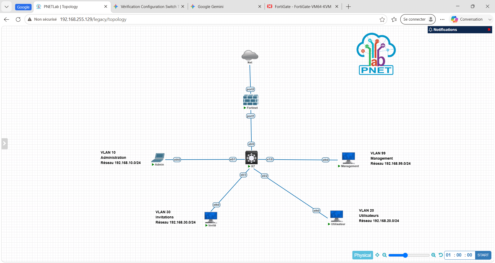
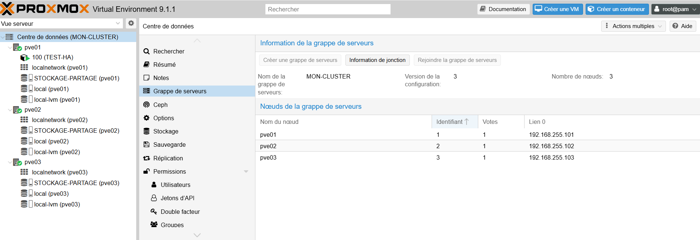
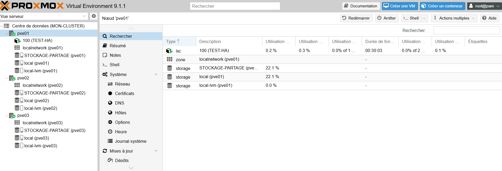
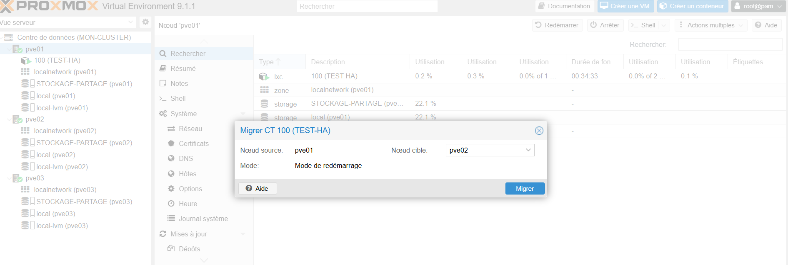
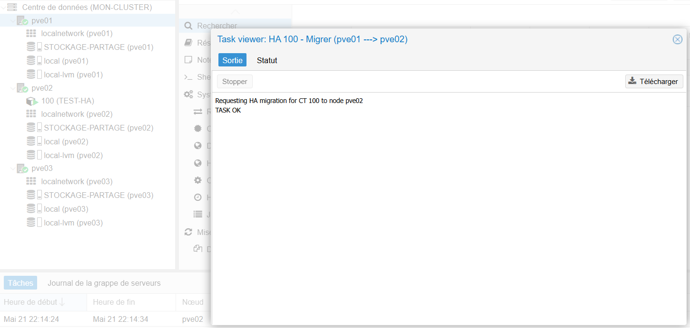
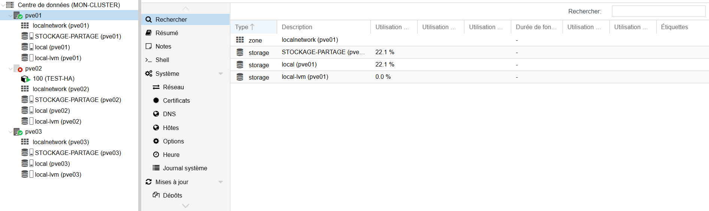
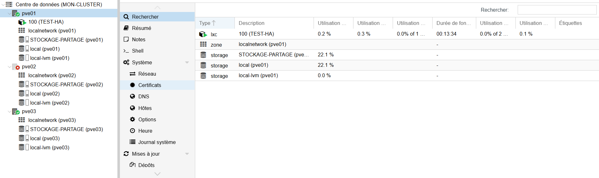

# Portfolio Technique — ZAMBO LEVI
## Licence Professionnelle ASUR (Administration & Sécurité des Réseaux)

Bienvenue sur mon portfolio professionnel. Vous trouverez ci-dessous la documentation technique de mes réalisations majeures.

---

## 🛡️ Étude de Cas : Sécurisation d'un réseau VLAN par l'intégration d'un pare-feu Next-Gen FortiGate

### 📋 1. Présentation du Projet & Cahier des Charges
Ce projet formalise la conception et la sécurisation d'une infrastructure réseau segmentée et hautement cloisonnée, simulée au sein de l'environnement **PNETLab**. L'objectif est d'appliquer une politique stricte de type *Least Privilege* en utilisant un pare-feu FortiGate (VM64-KVM) comme passerelle de routage inter-VLAN et de filtrage applicatif.

---

### 🗺️ 2. Architecture Réseau & Topologie
La topologie s'articule autour d'un routeur/switch central distribuant quatre zones réseau distinctes vers les interfaces du pare-feu FortiGate :

*   **VLAN 10 (Administration) :** Subnet `192.168.10.0/24` — Zone critique contenant le poste d'administration réseau.
*   **VLAN 20 (Utilisateurs) :** Subnet `192.168.20.0/24` — Zone des collaborateurs internes.
*   **VLAN 30 (Invités) :** Subnet `192.168.30.0/24` — Zone visiteurs isolée.
*   **VLAN 99 (Management) :** Subnet `192.168.99.0/24` — Zone d'administration des infrastructures.
*   **Interface WAN (port2) :** Interconnexion vers le réseau externe/Internet.

---

### ⚙️ 3. Implémentation des Règles de Filtrage (Firewall Policy)
Les politiques de flux implémentées sur le FortiGate traduisent les exigences strictes de sécurité de la maquette :

1.  **Gestion des accès Admin (VLAN 10) :** Autorisation complète vers les zones Utilisateurs (VLAN 20), Administration (VLAN 10), et Management (VLAN 99).
2.  **Accès Internet Privilégié (VLAN 10 & VLAN 20/30) :** Activation du NAT (Enabled) pour les sorties WAN avec profils de filtrage dédiés.
3.  **Règle de Blocage Implicite (Implicit Deny) :** Tout flux inter-zone non explicitement listé est immédiatement rejeté (Action: `DENY`).

---

### 🎯 4. Phase de Recette & Validation (Preuves Concrètes)

La validation de la politique de sécurité a été testée et validée via des captures de terminaux VPCS et l'analyse en temps réel du journal des flux du FortiGate.

#### A. Test de Connectivité WAN (Succès attendu)
Depuis la zone Invité, le trafic à destination d'Internet (IP de test `8.8.8.8`) est pleinement fonctionnel. Les logs internes confirment le passage avec succès via la règle ID 3 (Résultat : `84 B / 84 B`).

#### B. Test de Cloisonnement Inter-VLAN (Blocage attendu)
Une tentative de communication ICMP initiée depuis le poste **Utilisateur** (`192.168.20.10`) vers la zone sensible **Administration** (`192.168.10.10`) se solde par un échec systématique (`timeout`). 

Le module *Forward Traffic* du FortiGate intercepte et journalise immédiatement ces violations via l'Action `Deny: policy...` sous la règle implicite (Policy ID 5).

#### C. Validation de la Passerelle de Management
Le bon fonctionnement des sous-interfaces et de la passerelle du FortiGate est validé par un diagnostic réseau réussi depuis l'hôte de Management vers son interface d'infrastructure dédiée en `192.168.99.1`.

---

## 🎛️ Étude de Cas #2 : Mise en place d’un cluster de virtualisation Proxmox VE en Haute Disponibilité (HA)

### 📋 1. Présentation du Projet & Objectifs
L'objectif de cette réalisation est de concevoir une infrastructure de virtualisation redondante et hautement disponible capable de supporter les applications critiques d'une entreprise. La mise en place d'un cluster permet de mutualiser les ressources physiques, de faciliter la maintenance à chaud et de garantir la continuité de service en cas de défaillance matérielle.

**Objectifs clés :**
*   Déploiement et interconnexion de 3 nœuds hyperviseurs Proxmox VE (PVE 9.1.1).
*   Configuration du Quorum et de la grappe de serveurs via Corosync.
*   Intégration d'un stockage partagé inter-nœuds pour permettre la mobilité des données.
*   Mise en œuvre et validation de la Haute Disponibilité (HA) lors d'un scénario de crash.

---

### 🗺️ 2. Architecture du Cluster & Configuration de la Grappe
La grappe de serveurs, baptisée **MON-CLUSTER**, rassemble 3 nœuds physiques distincts disposant chacun d'un vote actif pour garantir la validité du Quorum :

*   **pve01 :** `192.168.255.101` (1 vote)
*   **pve02 :** `192.168.255.102` (1 vote)
*   **pve03 :** `192.168.255.103` (1 vote)

L'onglet *Grappe de serveurs* confirme la parfaite jonction des nœuds et la communication active via l'interface réseau locale.

---

### ⚙️ 3. Gestion des Ressources & Migration à Chaud
Pour valider la flexibilité de l'infrastructure, un conteneur léger de test (`CT 100 - TEST-HA`) a été déployé initialement sur le nœud **pve01**.

#### Procédure de migration planifiée :
La maintenance d'un nœud physique nécessite le déplacement transparent de ses charges actives. Une procédure de migration vers le nœud cible **pve02** a été initiée en mode redémarrage.

Le journal des tâches (Task viewer) valide le bon traitement de l'opération en quelques secondes avec le statut final `TASK OK`.

---

### 🎯 4. Phase de Recette : Simulation de Panne et Haute Disponibilité (HA)
La preuve ultime de résilience réside dans la capacité du cluster à réagir de manière autonome face à une panne matérielle sévère.

#### Étape 1 : Simulation du crash du nœud hôte
Le conteneur `CT 100` étant hébergé sur le nœud **pve02**, une extinction brutale et non planifiée de cet hyperviseur a été provoquée. L'interface réseau remonte immédiatement une alerte rouge signalant la perte de contact complète avec le nœud **pve02**.

#### Étape 2 : Basculement automatique (Failover HA)
Grâce au maintien du quorum par les nœuds restants (**pve01** et **pve03**), le gestionnaire de Haute Disponibilité intégré à Proxmox détecte l'absence de signal (fencing) du nœud en panne. 

De manière totalement autonome, le cluster réassigne et redémarre instantanément le conteneur `CT 100` sur l'un des nœuds sains restants. On constate ici sa reprise d'activité immédiate sur le nœud **pve01** avec un temps d'exécution opérationnel retrouvé.

